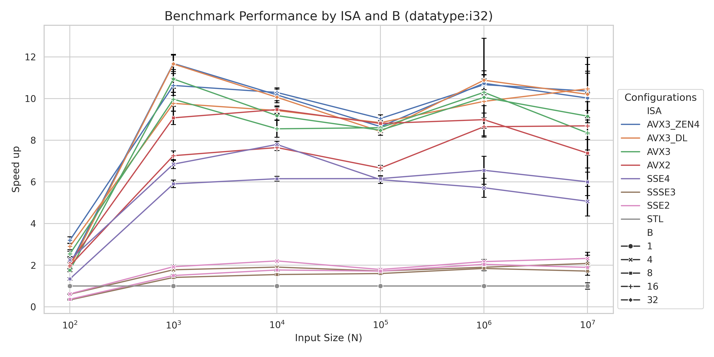
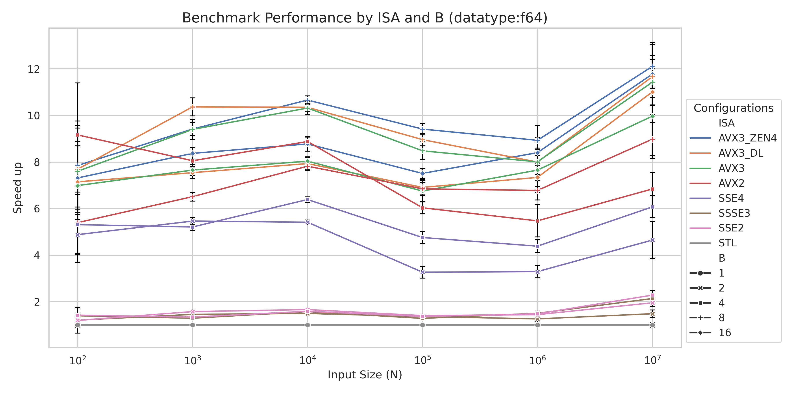
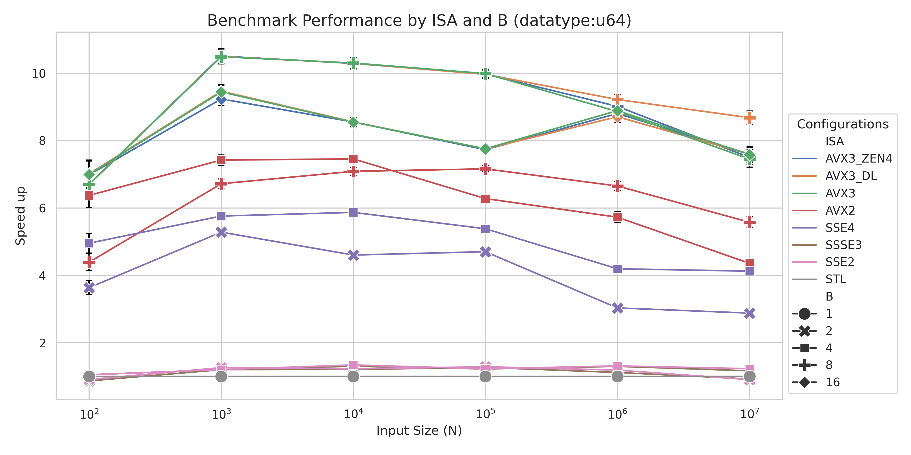
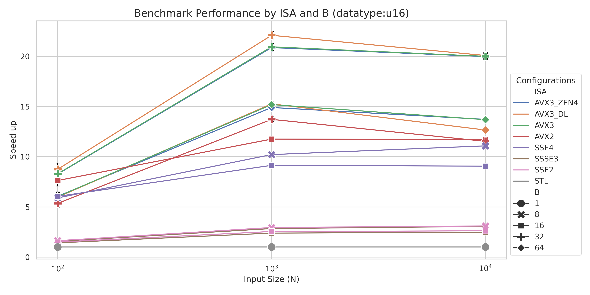
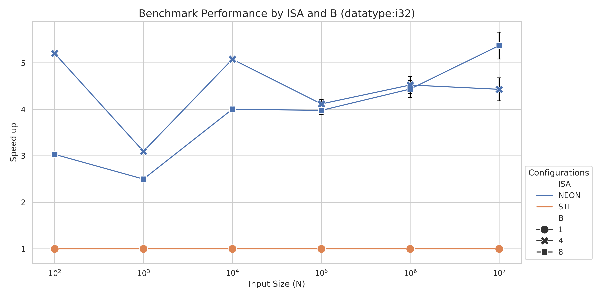
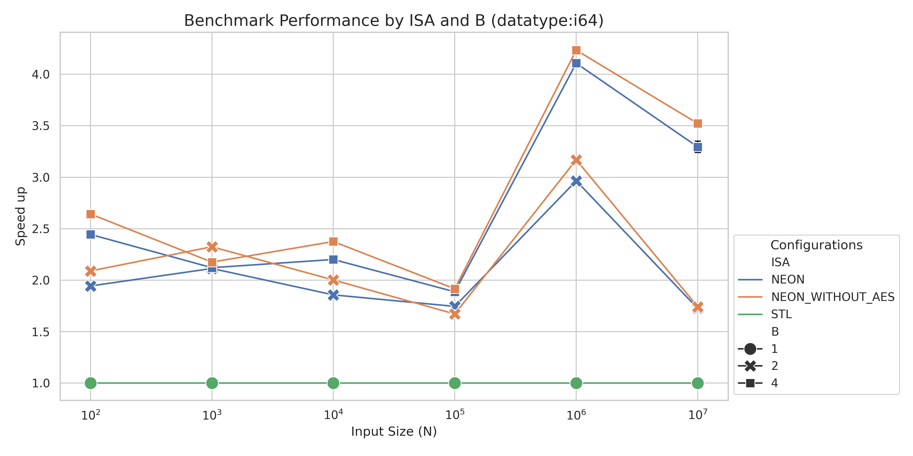

# Static B+-Tree with Google Highway

In this repository we implement a static B+-Tree as defined in [this algorithmica.org article](https://en.algorithmica.org/hpc/data-structures/s-tree/#b-tree-layout-1) using [Google Highway](https://github.com/google/highway).

## Motivation

For a [recent paper](https://arxiv.org/abs/2508.19891) we deployed a static B+-Tree to speedup query times when reporting contained points in a rectangle.
We originally used compiler intrinsics and some self-written header file to manage AVX instructions.
However, this was kind of tedious and did not allow us to test on a wide-variety of machines.

##  Setup a repository & discover available hardware architectures on your device

We first start by initializing a bazel repository with sensible defaults (see .bazelversion,.gitignore, WORKSPACE). [bazelisk](https://github.com/bazelbuild/bazelisk) is a good tool to quickly install the right bazel version.
We populate our MODULE.bazel with the dependencies needed:

```
bazel_dep(name = "googletest", version = "1.17.0.bcr.2")
bazel_dep(name = "highway", version = "1.3.0")
```
The first one is needed to supply some headers for testing.

### Listing architectures

With this setup we can query which architectures are available via highway:

```sh
$ bazel run -c opt @highway//:list_targets                                                                 
...
Executing tests from @@highway+//:list_targets
-----------------------------------------------------------------------------
Compiler: GCC 1303
Config: emu128:0 scalar:0 static:0 all_attain:0 is_test:0
Have: constexpr_lanes:1 runtime_dispatch:1 auxv:1 f16 type:1/ops1 bf16 type:1/ops1
Compiled HWY_TARGETS:   AVX10_2 AVX3_SPR AVX3_ZEN4 AVX3_DL AVX3 AVX2 SSE4 SSSE3 SSE2
HWY_ATTAINABLE_TARGETS: AVX10_2 AVX3_SPR AVX3_ZEN4 AVX3_DL AVX3 AVX2 SSE4 SSSE3 SSE2 SCALAR
HWY_BASELINE_TARGETS:   SSE2 SCALAR
HWY_STATIC_TARGET:      SSE2
HWY_BROKEN_TARGETS:     LASX LSX
HWY_DISABLED_TARGETS:  
Current CPU supports:   AVX3_ZEN4 AVX3_DL AVX3 AVX2 SSE4 SSSE3 SSE2 EMU128 SCALAR
```

As we can see, there is a fairly modern CPU from AMD in my machine, supporting AVX3.

## Setting up the Highway skeleton & class
We now define our `cc_library` rule in `static_btree/BUILD` with the highway dependency:
```
cc_library(
    name = "static_btree",
    hdrs = ["static_btree.hh"],
    deps = ["@highway//:hwy"],
)
```

We initialize the static_btree.hh file with the namespaces and macros needed for highway. 
We code a dummy `ImplicitStaticBTree` struct, that has a constructor taking in values as a vector and a lowerbound method, to get the index of a lowerbound.

```cpp
//static_btree.hh
// notice that there is no #pragma once (would cause the reinclusion in the cc to fail)
// Highway needs to include this header later multiple times, with different HWY_TARGET/HWY_NAMESPACE values for each instruction set.
#include "hwy/highway.h"

HWY_BEFORE_NAMESPACE();   // at file scope
namespace henrixapp {     // optional
namespace static_btree {  // optional
namespace HWY_NAMESPACE {
namespace hn = hwy::HWY_NAMESPACE;  // later used to get the correct functions for the current
                                        // architecture.
template <typename ValueType>
struct ImplicitStaticBTree {
  explicit ImplicitStaticBTree(const std::vector<ValueType>& values) {}
  size_t lower_bound(const ValueType val) { return 0; }
};
// NOLINTNEXTLINE(google-readability-namespace-comments)
}  // namespace HWY_NAMESPACE
}  // namespace static_btree
}  // namespace henrixapp
HWY_AFTER_NAMESPACE();
```

### Adding a simple test case
Before we continue we add a simple testcase (and a cc_test):

```python
# Add to static_btree/BUILD
cc_test(
    name = "static_btree_test",
    srcs = ["static_btree_test.cc"],
    deps = [
        ":static_btree",
        "@googletest//:gtest",
        "@googletest//:gtest_main",
        "@highway//:hwy_test_util",
    ],
)
```
In the static_btree_test.cc we define `HWY_TARGET_INCLUDE` to link to itself, before including `#include "hwy/foreach_target.h`.
The highway header and our header file need to be included afterward.

We define a basic test for our class with some static data.
The HWY_NAMESPACE is properly replaced for every type.
Guarded by a `HWY_ONCE`, we register tests for every data type.
```cpp
// static_btree/static_btree_test.cc
#include "hwy/tests/hwy_gtest.h"
// clang-format off
#undef HWY_TARGET_INCLUDE
#define HWY_TARGET_INCLUDE "static_btree/static_btree_test.cc"
#include "hwy/foreach_target.h"  // IWYU pragma: keep
#include "hwy/highway.h"
#include "hwy/tests/test_util-inl.h"
// clang-format on
#include "static_btree/static_btree.hh"

HWY_BEFORE_NAMESPACE();
namespace static_btree_test {
namespace HWY_NAMESPACE {
namespace hn = hwy::HWY_NAMESPACE;
struct BasicTests {
   template <class VT>
  void operator()(VT) const {
    std::vector<VT> values{1, 10, 14, 28, 36};
    // We will later replace this and generate test for every architecture available
    henrixapp::static_btree::HWY_NAMESPACE::ImplicitStaticBTree<VT> btree(values);
    HWY_ASSERT_EQ(5, btree.lower_bound(100));
    HWY_ASSERT_EQ(0, btree.lower_bound(0));
    HWY_ASSERT_EQ(0, btree.lower_bound(1));
  }
};
void TestAllBTree() { hn::ForAllTypes(BasicTests()); }
}  // namespace HWY_NAMESPACE
}  // namespace static_btree_test
HWY_AFTER_NAMESPACE();
#if HWY_ONCE
namespace static_btree_test {
namespace {
HWY_BEFORE_TEST(BTreeTest);
HWY_EXPORT_AND_TEST_P(BTreeTest, TestAllBTree);
HWY_AFTER_TEST();
}  // namespace
}  // namespace static_btree_test
HWY_TEST_MAIN();
#endif  // HWY_ONCE
```

Executing the test, you will get:

```sh
$ bazel test -c dbg static_btree:static_btree_test --test_output=all
...
==================== Test output for //static_btree:static_btree_test:
Running main() from gmock_main.cc
[==========] Running 7 tests from 1 test suite.
[----------] Global test environment set-up.
[----------] 7 tests from BTreeTestGroup/BTreeTest
[ RUN      ] BTreeTestGroup/BTreeTest.TestAllBTree/AVX3_ZEN4
Abort at static_btree_test.cc:24: AVX3_ZEN4, u64x1 lane 0 mismatch: expected '0x0000000000000005', got '0x0000000000000000'.

================================================================================
INFO: Found 1 test target...
Target //static_btree:static_btree_test up-to-date:
  bazel-bin/static_btree/static_btree_test
INFO: Elapsed time: 11.752s, Critical Path: 11.38s
INFO: 27 processes: 15 action cache hit, 27 linux-sandbox.
INFO: Build completed, 1 test FAILED, 27 total actions
//static_btree:static_btree_test                                         FAILED in 0.0s
```
You can see that using the `HWY_ASSERT_EQ` we can see on which architecture this test failed, here it is AVX3_ZEN4, the first architecture in the list for our machine.
If you want to see a failure on a specific data-type later, you can add a `258` to the list and compile with `--cxxopt=-Wno-narrowing`.
Then only the 8-bit data-types will fail.

## Constructing the B+-Tree

We follow the instructions from the [algorithmica.org article](https://en.algorithmica.org/hpc/data-structures/s-tree/#construction-1) to construct a static, implicit, b+-tree.
Please refer to this article to better understand B+-Trees.
Roughly speaking, we build a tree from leaves to the root, where each leaf contains B branches and has B+1 children. However, we do not want to branch on the branches with if statements since those are expensive on CPUs.
Instead, we want to exploit the predictable positioning of children relative to their parent node and compute the next child node to be queried. Here is a visualization of a B+-tree (with B=4):
```
            [  20  |  40  |  MAX  | MAX ]  <-- Root (Internal Node)
            /          |      \
           /           |       \_________________
          /            |                         \
  [ 5 | 10 | 15 | 17 ] [ 20 | 25 | 35 | 39 ]    [ 40 | 50 | 60 ]  <-- Leaves
```
In an implicit layout (just using one array) this looks like this (X to separate layers) :

```
 5 | 10 | 15 | 17 | 20 | 25 | 35 | 39 | 40 | 50 | 60  X 20 | 40| MAX | MAX
```

SIMD instructions can speed up operations executed in a program and there are plenty of standards (every modern CPU platform has at least one).
What we have to know here is, that SIMD instructions work on parallel on multiple data inputs. In Highway, each of these inputs is called a `lane`.
Similarly to the article, we want our code to use B=2* available Lanes per architecture (we will later also test for B=Lanes). This allows us to compare every entry in the node of the b-tree with two load instructions, a compare instruction and then counting the number of true results.
The number of Lanes could change during runtime according to the highway doc in the future, but is currently not the case. For now, we assume that during runtime it does not change.

In Highway a [Tag](https://github.com/google/highway/blob/master/g3doc/quick_reference.md#vector-and-tag-types) is used to select the correct overloaded function. 

```cpp
// in static_btree/static_btree.hh
  static constexpr const hn::ScalableTag<ValueType> d{};
#if HWY_HAVE_CONSTEXPR_LANES
  static const HWY_LANES_CONSTEXPR size_t B = 2 * hn::Lanes(d);
#else
  const size_t B;
#endif
  explicit ImplicitStaticBTree(const std::vector<ValueType>& values)
#if !HWY_HAVE_CONSTEXPR_LANES
      : B(2 * hn::Lanes(d))
#endif
  {
  }
```

### Writing the helper functions
Before we can allocate the memory for our b-tree, we need to define some helper functions to calculate the height and size of the tree.
We use `HWY_LANES_CONSTEXPR` instead of `constexpr` to mark these functions, so that the compiler can optimize better, if constexpr is available.
Instead of the static constexpr function used in the article, we use a std::vector to store the offsets.

The allocation of the btree is done via `hwy::AllocateAligned`, making sure that our array is aligned.
Since we later want to use Load (requiring the offsets to be a multiple of #Number of Lanes), we check that every offset is a multiple of `B` (which is a multiple of #Number of Lanes).  
```cpp
// in static_btree.hh
  HWY_LANES_CONSTEXPR size_t blocks(size_t n) { return (n + B - 1) / B; }
  HWY_LANES_CONSTEXPR size_t prev_keys(size_t n) { return (blocks(n) + B) / (B + 1) * B; }
  HWY_LANES_CONSTEXPR size_t height(size_t n) { return (n <= B ? 1 : height(prev_keys(n)) + 1); }
  const size_t N;
  const size_t H;
  size_t overall_size;
  std::vector<size_t> offsets;
  hwy::AlignedFreeUniquePtr<ValueType[]> btree;
  explicit ImplicitStaticBTree(const size_t N)
      :
#if !HWY_HAVE_CONSTEXPR_LANES
        B(2 * hn::Lanes(d)),
#endif N(N),
        H(height(N))

  {
    offsets.resize(H + 1, 0);
    size_t k = 0, n = N;
    for (size_t i = 1; i < H; i++) {
      k += blocks(n) * B;  // every offset is multiple of B
      n = prev_keys(n);
      offsets[i] = k;
    }
    overall_size = k + B;
    offsets[H] = overall_size;
    btree = hwy::AllocateAligned<ValueType>(overall_size);
  }
```
### Building the implicit tree

The algorithm for building is simply the algorithm given by the article.

```cpp
 explicit ImplicitStaticBTree(const std::vector<ValueType>& values)
      : ImplicitStaticBTree(values.size()) {
    std::copy(values.begin(), values.end(), btree.get());
    build();
  }
  static const constexpr ValueType max_value = std::numeric_limits<ValueType>::max();
  void build() {
    // pad the array
    std::fill(btree.get() + N, btree.get() + overall_size, max_value);
    // build layer by layer
    for (size_t h = 1; h < H; h++) {
      for (size_t i = 0; i < offsets[h + 1] - offsets[h]; i++) {
        // i = k * B + j
        size_t k = (i / B), j = i - (k * B);
        k = k * (B + 1) + j + 1;  // compare to the right of the key
        // and then always to the left
        for (size_t l = 0; l < h - 1; l++) k *= (B + 1);
        // pad the rest with infinities if the key doesn't exist
        btree[offsets[h] + i] = ((k * B) < N ? btree[k * B] : max_value);
      }
    }
  }
```
We skip the permutation of the nodes as outlined in the article, since we later will see that this is a fine-grained improvement, not available on all platforms in highway.

### Implementing the lower-bound

We can now write the logic needed to find the lower-bound for a value. We want to compare multiple values at the same time, so we populate a Vec `x` with the value we want to search for.
Notice how we use the `Tag` to use the right implementation.
The algorithmica implementation uses the greater-eq  and bit-tricks to find the lowerbound in every layer of the b-tree.
After consulting the [quick-reference](https://github.com/google/highway/blob/master/g3doc/quick_reference.md#test-mask), we replace this by a less-then comparison and counting 
how many entries are `true` in the mask.

In the reference there is also `FindFirstTrue` or `FindFirstFalse`, but this returns a `-1` if no value is found, which would need an extra branch to detect.
Feel free to change the implementation to `FindFirstFalse` with an extra if-statement and benchmark it.

```cpp
  size_t lower_bound(const ValueType val) {
    size_t k = 0;  // we assume k already multiplied by B to optimize pointer arithmetic
    auto x = hn::Set(d, val);
    for (size_t h = H - 1; h > 0; h--) {
      auto i = hn::CountTrue(d, hn::Lt(hn::Load(d, btree.get() + offsets[h] + k), x)) +
               hn::CountTrue(d, hn::Lt(hn::Load(d, btree.get() + offsets[h] + k + B / 2), x));
      //Above it is important that k is a multiple of # of Lanes.
     k = k * (B + 1) + (i * B); //this formula ensures that, since we start with k=0.
    }
    auto i = hn::CountTrue(d, hn::Lt(hn::Load(d, btree.get() + k), x)) +
             hn::CountTrue(d, hn::Lt(hn::Load(d, btree.get() + k + B / 2), x));

    auto result = (k + i);
    return result;
  }
```

In order to test our algorithm, we add a Benchmark to `static_btree/static_btree_benchmark.cc` and add the dependency to our benchmark:

```python
# in static_btree/BUILD
cc_binary(
    name = "static_btree_benchmark",
    srcs = [
        "benchmark_helpers.hh",
        "static_btree_benchmark.cc",
    ],
    visibility = ["//visibility:public"],
    deps = [
        ":static_btree",
        "@googletest//:gtest",
        "@highway//:hwy_test_util",
        "@highway//:nanobenchmark",
    ],
)
```
In a separate header file we define a uniform sampler for integral and floating point numbers using SFINAE:
```cpp
#pragma once
#include <limits>
#include <random>
#include <vector>
template <class T>
typename std::enable_if<std::is_integral<T>::value, std::vector<T>>::type gen_data(
    size_t s, std::mt19937_64& rng) {
  std::vector<T> points(s);
  std::uniform_int_distribution<T> dist(std::numeric_limits<T>::min(),
                                        std::numeric_limits<T>::max());
  for (auto& p : points) {
    p = dist(rng);
  }
  return points;
}

template <class T>
typename std::enable_if<std::is_floating_point<T>::value, std::vector<T>>::type gen_data(
    size_t s, std::mt19937_64& rng) {
  std::vector<T> points(s);
  std::uniform_real_distribution<double> dist(std::numeric_limits<T>::min(),
                                              std::numeric_limits<T>::max());
  for (auto& p : points) {
    p = static_cast<T>(dist(rng));
  }
  return points;
}
```
Note that some float16s defined in highway are not part of the STL, so we decided to just reopen the `std` namespace and manually add them.
## Benchmarking
Now to the benchmark, instead of google benchmark we use the MeasureClosure provided in highway's [nano-benchmark](https://github.com/google/highway/blob/master/hwy/nanobenchmark.h) file.
This measures the running time in ticks, we normalize by the ticks reported when using `std::lower_bound`.
We test on several sizes of input data, depending on the maximum value that the datatype can hold, and fix the number of queries to 10000.
To make sure that the queries are actually executed, we XOR-the results of our queries.
The nano-benchmark framework was built around sorting functions, and expects size_t as `FuncInput`.
This is somewhat inflexible and could be an avenue for improvement in highway (I did not find much literature to benchmark other things than sorting in the repository).


```cpp
//static_btree/static_btree_benchmark.cc
//... other includes, and also for-each target
//...
#include "static_btree/static_btree.hh"
//..
namespace static_btree_bench {

namespace HWY_NAMESPACE {
namespace {
static constexpr const int query_sets = 1;
static constexpr const int queries_per_sets = 10000;
template <class LowerBoundable>
struct Benchmark {
  using DataType = typename LowerBoundable::DataType;
  LowerBoundable instance;
  std::vector<std::vector<DataType>> queries;

  Benchmark(const std::vector<DataType>& inputs, const std::vector<std::vector<DataType>>& queries)
      : instance(inputs), queries(queries) {}
  size_t operator()(size_t i) {
    size_t Mask = 0;
    for (auto p : queries[i]) {
      Mask ^= instance.lower_bound(p);
    }
    return Mask;
  }
};
template <typename DS, int n_queries, int num_per_query>
void RunBench(const std::string& name, size_t n_inputs) {
  using DT = typename DS::DataType;
  srand(42);
  std::mt19937_64 rng(rand());
  hwy::Result results[n_queries];
  hwy::FuncInput input[n_queries];
  std::iota(input, input + n_queries, 0);
  std::vector<DT> points = gen_data<DT>(n_inputs, rng);
  std::vector<std::vector<DT>> queries(n_queries);
  for (auto& q : queries) {
    q = gen_data<DT>(num_per_query, rng);
  }
  std::sort(points.begin(), points.end());
  Benchmark<DS> benchmark(points, queries);
  hwy::Params params;
  params.verbose = false;
  params.max_evals = 7;
  params.target_rel_mad = 0.002;

  auto result_count = 0;

  do {
    result_count = hwy::MeasureClosure([&](const hwy::FuncInput val) { return benchmark(val); },
                                       input, n_queries, results, params);
  } while (result_count != n_queries); //loop to get valid results
  double ticks = 0;
  double var = 0;
  for (size_t i = 0; i < n_queries; i++) {
    ticks += results[i].ticks;
    var += results[i].variability;
  }
  std::cout << name << "," << ticks / n_queries << "," << var / n_queries << std::endl;
}
}  // namespace
namespace hn = hwy::HWY_NAMESPACE;
struct BenchmarkSuite {
  template <typename DT>
  void operator()(DT) const {
    using BTree = henrixapp::static_btree::HWY_NAMESPACE::ImplicitStaticBTree<DT>;
    auto info = hwy::detail::MakeTypeInfo<DT>();
    char type_name[100];
    hwy::detail::TypeName(info, 1, type_name);
    for (size_t i = 100; i < std::numeric_limits<DT>::max(); i *= 10) {
      if (i > 1e7) {
        break;
      }
      RunBench<BTree, query_sets, queries_per_sets>(
          std::string(hwy::TargetName(HWY_TARGET)) + "," + std::to_string(BTree({}).B) + "," +
              std::to_string(i) + "," + std::string(type_name),
          i);
    }
  }
};
```

The registration for the benchmarks is relatively straight forward:
We have to export the functions and can then dynamically dispatch.
```cpp
void RunBenchmark() { hn::ForAllTypes(BenchmarkSuite()); }
// ...
}  // namespace HWY_NAMESPACE
}  // namespace static_btree_bench
#if HWY_ONCE
namespace static_btree_bench {
HWY_EXPORT(RunBenchmark);
//Other types of functions , not covered in the Readme
HWY_EXPORT(RunBenchmark1); 
HWY_EXPORT(RunStdLowerboundBenchmark);
void RunBenchmarks() {
  for (int64_t target : hwy::SupportedAndGeneratedTargets()) {
    hwy::SetSupportedTargetsForTest(target);
    HWY_DYNAMIC_DISPATCH(RunBenchmark)();
    HWY_DYNAMIC_DISPATCH(RunBenchmark1)();
  }
  HWY_DYNAMIC_DISPATCH(RunStdLowerboundBenchmark)();
  hwy::SetSupportedTargetsForTest(0);  // Reset the mask afterwards.
}
}  // namespace static_btree_bench
int main() {
  std::cout << "ISA,B,N,Type,cpu_mean,var" << std::endl;
  static_btree_bench::RunBenchmarks();
  return 0;
}
#endif
```
With this setup we are good to go to run on multiple platforms.

### Results
We generated the data for the plots by running `bazel run -c opt //static_btree:static_btree_benchmark > $PWD/results/<device>.csv`.
The plotting script was generated with the help of gemini (run `bazel run -c opt plot -- $PWD/results/<device>.csv $PWD/images/<device>` to generate a plot).

We plot the speed-up over the STL implementation for the queries for several sizes of input. We start at 100 and cut of at 10^7 or if the array has to contain duplicates (in other words we sample not more values than the maximum value).
Keep in mind that we use a uniform distribution and having other distributions could impact performance.
#### Laptop (AMD Ryzen 7840 Pro)
The tests were run with a power supply supplying energy.
##### (Signed) Integer 

The plot above shows the speedup for the available instruction-sets on the AMD CPU.
We can see that for smaller vectors (size=100), the speedup is not as big as for bigger arrays.
The older SSE instruction sets are even slower than the STL-lowerbound. These instruction set does not have that many Lanes, as seen by their reported `B` as 2 or 4.
On the same instruction set, e.g. AVX2 or SSE4, can also see that for larger inputs, that the algorithm with twice the lane width are faster, while for smaller inputs, it is not as benefical.
Overall, we can see a speedup of up to 11-12 times.

##### Larger Floating Points numbers (f64)

For double length (64-bit) floating points we report the numbers in the figure above.
Again, we can see that newer instruction sets, with higher number of Lanes speed up the search between 3 and 12 times.

#### Desktop (AMD Ryzen 9800X3D)
##### unsigned integer 64-bit

The figure shows the results for unsigned 64-bit integers.
Here we can also observe that having double the `B` is faster for bigger inputs (esp. for AVX2 (red line)), while for smaller inputs the smaller `B` value is better.

##### unsigned integer 16-bit

For smaller data-types, like 16 bit integers, we can report a speedup of over 20. The implementation using only one count instruction is faster than the one using two. 
Apparently, using twice as many comparisons hurts the performance for these small data types.

#### Other platforms

##### M1 Pro (int32)

The speedup on the Macbook Pro with M1Pro is not as pronounced as on the other platforms averaging between 3 and 5 for NEON instructions (the only supported advanced instruction set).
When going from 100 to 1000 points there seems to be a performance drop, esp. for B=4. This dip is also visible on all other data types, caused by the transition out of a size that fits the L1 cache.

##### Raspberry Pi 5 (int64)

The raspberry pi supports NEON as well (in two flavors).
The two flavors do not differ that much in terms of speed up.
This can be explained by the fact that we do not use their functional difference (AES).
Because the ARM processor does not have that much lanes, resulting in a B of 2 or 4, the speedup is not as good as on other platforms. 
The spike for 10^6 occurs in repeated experiments.
This can be explained by the b+tree being very full at this stage and probably a well aligned page-size.

## Conclusion

In our implementation description we saw, how well Google Highway is engineered and how easy it is to write a common interface for lots of types while being architecture agnostic. 
In our experiments we saw, how we speedup the btree implementation over a standard std::lower_bound algorithm. 
Depending on the datatype, we were able to speedup queries up to 20 times.

Future avenues of work include adjusting the memory layout, ordering the access pattern from root to leaves.